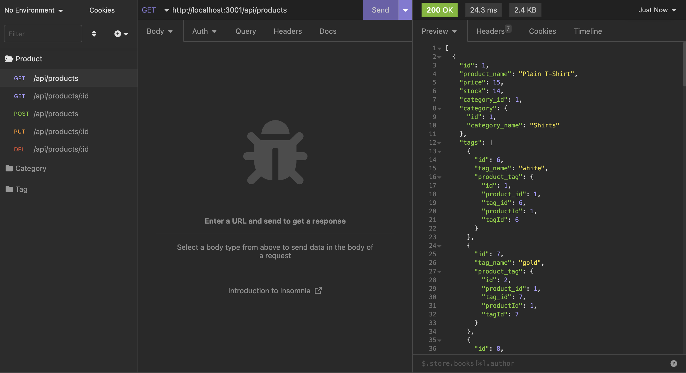
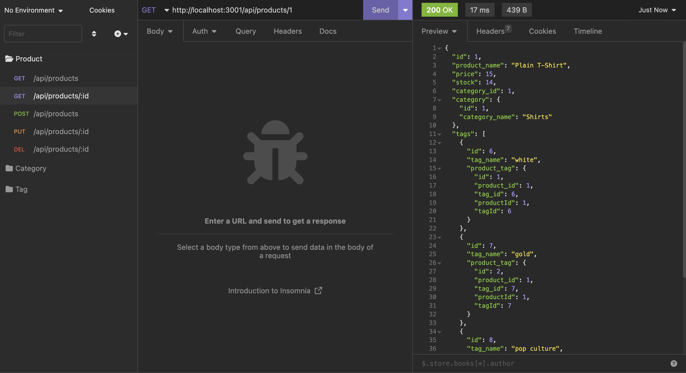
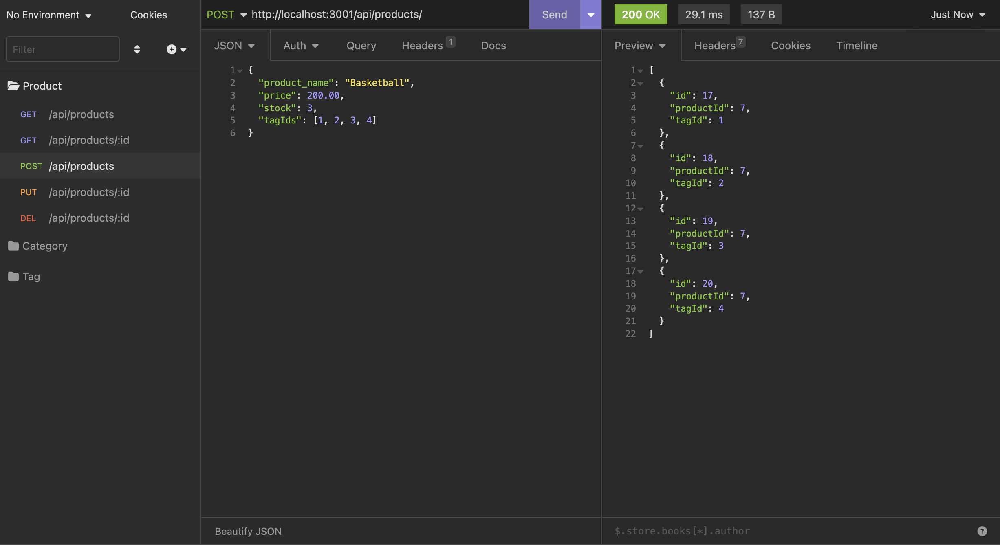
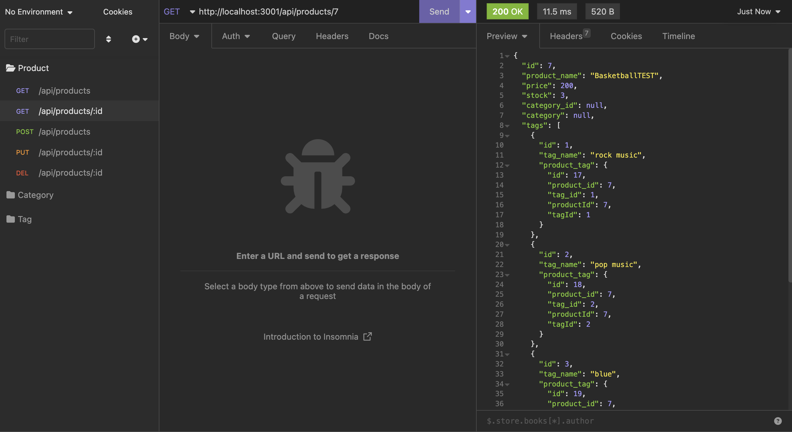

# E-commerce Back End Starter Code

## images
- get all

- get one

- create

- update



GIVEN a functional Express.js API

WHEN I add my database name, MySQL username, and MySQL password to an environment variable file
THEN I am able to connect to a database using Sequelize

WHEN I enter schema and seed commands
THEN a development database is created and is seeded with test data

WHEN I enter the command to invoke the application
THEN my server is started and the Sequelize models are synced to the MySQL database

WHEN I open API GET routes in Insomnia Core for categories, products, or tags
THEN the data for each of these routes is displayed in a formatted JSON

WHEN I test API POST, PUT, and DELETE routes in Insomnia Core
THEN I am able to successfully create, update, and delete data in my database


- update env
## video (test products and tags)
- $ npm run seed
- $ node server.js

- tags
    - GET   api/tags      get all
    - GET   api/tags/1    get one
    - POST  api/tags
        - ```{
                "category_name": "TEST"
            }```
    - GET   api/tags/id
    - PUT   api/tags/id
        - ```{
                "category_name": "TESTupdate"
            }```
    - DELETE api/tags/id
    - GET   api/tags/id    check null

- products
    - GET   api/products      get all
    - GET   api/products/1    get one
    - POST  api/products
        - ```{
                "product_name": "TEST",
                "price": 200.00,
                "stock": 3,
                "tagIds": [1, 2, 3, 4]
            }```
    - GET   api/products/id
    - PUT   api/products/id
        - ```{
                "product_name": "TESTupdate",
            }```
    - DELETE api/products/id
    - GET   api/products/id    check null


